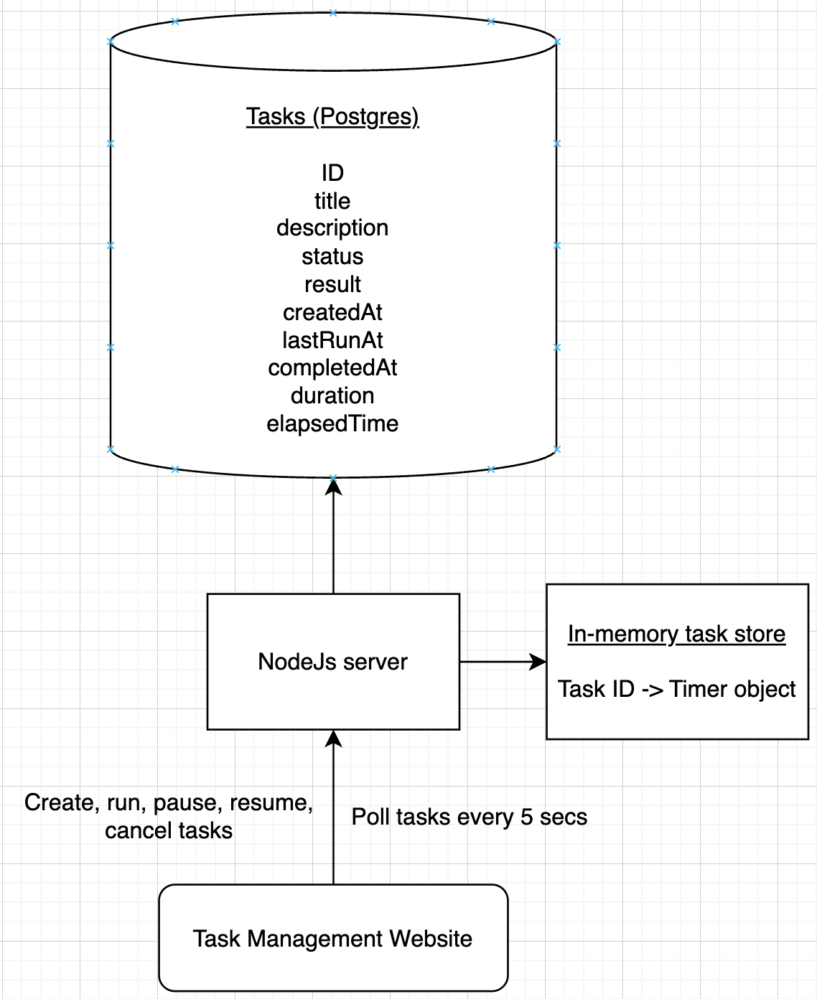

# Task Management System

## Overview

[**Demo video**](https://youtu.be/oBzRmrYNjB8)

This is a task management website that allows you to create, run, pause and cancel tasks. It is built with React, Node.js, [Prisma](https://www.prisma.io/) and PostgreSQL.

Links: [Frontend repo](https://github.com/mynamenn/task-management-ui), [Backend repo](https://github.com/mynamenn/task-processing-backend).

## Project Setup

To run this project:

1. Clone task-processing-backend [repository](https://github.com/mynamenn/task-processing-backend).
2. Make sure Docker is installed and opened.
3. Run `docker compose up` in the root directory of the project.
4. Wait for the containers to start.
5. Open [http://localhost:3000](http://localhost:3000) in your browser and you will see the website!

## Architecture

## Frontend Decisions

#### Polling vs Streaming of tasks

Streaming is generally used for real-time applications which requires real-time updates. However, it comes with some costs such as higher memory & CPU usage to maintain connections and streaming is not supported by all browsers.

For this demo, I've chosen polling because tasks aren't real-time and don't have frequent updates.

Currently, the frontend fetches all tasks every 5s. A polling optimisaiton idea is to send the hash of all tasks to the backend and only send all tasks if the hash has changed. Another idea is to send the tasks that have changed for the past 30s through `lastUpdatedAt` field.

#### Authentication & Authorization

User authentication & authorization aren't implemented in demo but it's crucial in a production task management system. For example, users should have tiered access controls for a shared task management system.

This can be implemented using Firebase authentication, Node's [passport.js](https://www.passportjs.org/) library for API authentication and middlewares for authorization.

## Backend Decisions

#### Database

SQL database is chosen because we need ACID transactions to ensure reliable state changes for concurrent status updates. This system is write-heavy, so the benefits of NoSQL read performance aren't relevant here.

#### In-memory task store to simulate task execution

To simulate async task execution, I have an in-memory hashmap which maps task IDs to timer instances. `taskStore.js` uses `setTimeout` to delay the task execution which marks a task as completed.

For pausing and resuming a task, I've used `clearTimeout` to clear a timer instance and also update the elapsed time so users can "resume" a task.

## Extensions

For frontend, as the number of tasks increase, we will need pagination to ensure efficient loading of tasks. We should also have account creation with access controls.

For backend, we should replace `taskStore.js` (which simulates task execution with `setTimeout`) with a production task queue like [Celery](https://www.fullstackpython.com/celery.html).

In general, we should use TypeScript instead of JavaScript for this system for better type safety and maintainability. JS was used for this demo since I have limited time. Also, frontend E2E tests and backend tests must be implemented in a production system.
